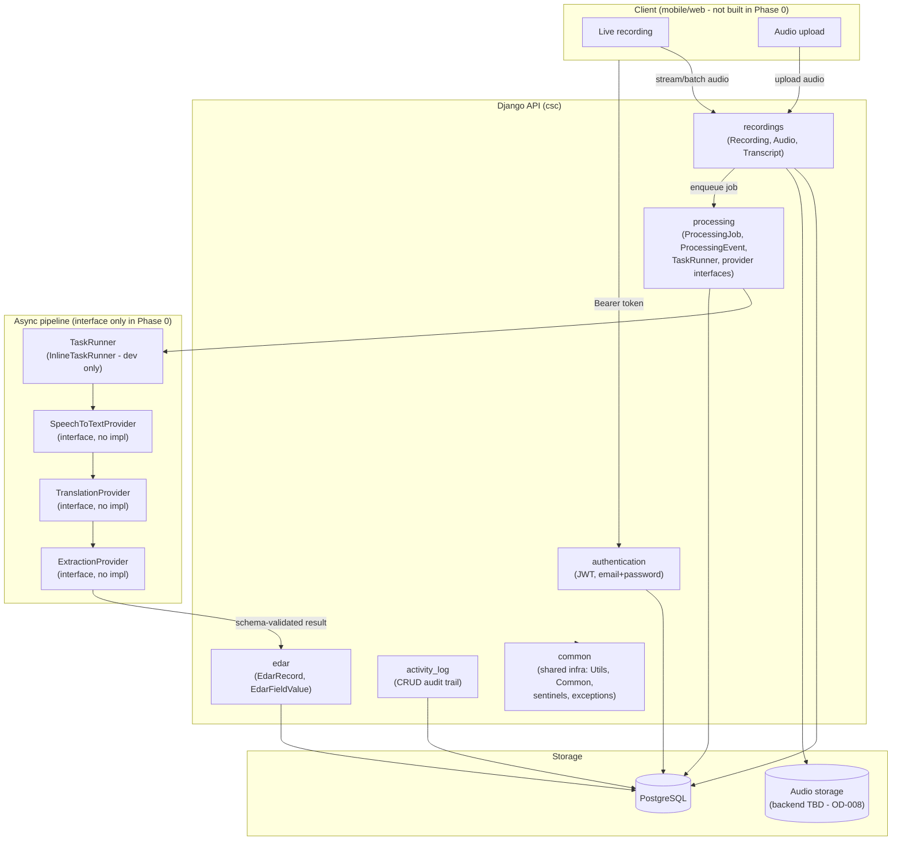

# System Architecture — v1 (Phase 0)

This is the Phase 0 architecture snapshot. It will be superseded by v2 once Phase 1 picks
concrete providers and a task-queue technology (`docs/open-decisions.md`).

## 1. Component diagram



## 2. Layering (within the API, per domain app)

```
URL (urls.py)
  -> Controller (controller.py): @extend_schema, @api_view, request validation decorator
    -> View (views.py): "<Domain>View" business logic, @Common().exception_handler,
                          transaction.atomic()
      -> Model (models/*.py): Django ORM, fat-model static methods (create/update/get/get_all)
```

Adopted unchanged from PMS (`docs/pms-reference-analysis.md` §3).

## 3. The three layers of truth, spatially

```
┌─────────────────────────────────────────────────────────────────┐
│ Layer 1 — Raw evidence                                           │
│   Audio (immutable once stored)                                  │
└─────────────────────────────────────────────────────────────────┘
                              │ read-only input to
                              ▼
┌─────────────────────────────────────────────────────────────────┐
│ Layer 2 — AI interpretation                                      │
│   Transcript (ORIGINAL, ENGLISH)                                 │
│   EdarFieldValue (layer=AI) — confidence, source span, version   │
└─────────────────────────────────────────────────────────────────┘
                              │ officer reviews, never overwrites
                              ▼
┌─────────────────────────────────────────────────────────────────┐
│ Layer 3 — Human-approved record                                  │
│   EdarFieldValue (layer=APPROVED) — updated_by, updated_at       │
│   EdarRecord.review_status = APPROVED                            │
└─────────────────────────────────────────────────────────────────┘
```

## 4. What exists in Phase 0 vs. what's drawn for Phase 1

Solid in Phase 0: `authentication`, `common`, `activity_log` (working code), the
`recordings`/`processing`/`edar` **models** and the `TaskRunner`/provider **interfaces**
(no concrete provider, no concrete queue). Everything under "Client" and the concrete
contents of "Async pipeline" boxes other than the interfaces themselves are Phase 1+.

## 5. Related documents

`docs/architecture-decisions.md` (why), `docs/domain-model.md` (exact schema),
`docs/processing-pipeline.md` (stage contracts), `docs/api-architecture.md` (HTTP surface).
